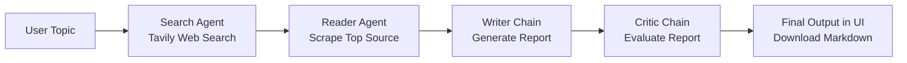

# Multi-Agent Research System

A modular multi-agent research assistant built with LangChain and Streamlit.
It orchestrates specialized agents to search the web, read source content,
write a structured report, and critique the final output.

## Features

- Multi-agent workflow with clear step-by-step execution
- Web search via Tavily API
- Multi-strategy URL content extraction
- Report generation using LLM prompt chain
- Critic/evaluation chain for quality feedback
- Interactive Streamlit UI with pipeline progress and downloadable report

## Tech Stack

- Python 3.10+
- LangChain ecosystem:
	- `langchain`
	- `langchain-core`
	- `langchain-community`
	- `langchain-openai`
- LLM provider: OpenAI (via `ChatOpenAI`)
- UI: Streamlit
- Web search: Tavily (`tavily-python`)
- Web extraction and parsing:
	- `requests`
	- `beautifulsoup4`
	- `readability-lxml`
	- `trafilatura`
	- `lxml`
- Config/env management: `python-dotenv`
- Developer utilities: `rich`, `ipykernel`

## Project Structure

```text
.
|-- app.py
|-- main.py
|-- requirements.txt
`-- src/
		|-- agents/
		|   `-- agents.py
		|-- pipelines/
		|   `-- pipeline.py
		`-- tools/
				`-- tools.py
```

## Architecture (Brief)

The system follows a sequential agent pipeline:

1. Search Agent
2. Reader Agent
3. Writer Chain
4. Critic Chain



## Installation

### 1. Clone the repository

```bash
git clone <your-repo-url>
cd Multi_agent_reseach_system
```

### 2. Create and activate virtual environment

Windows (PowerShell):

```powershell
python -m venv venv
.\venv\Scripts\Activate.ps1
```

macOS/Linux:

```bash
python3 -m venv venv
source venv/bin/activate
```

### 3. Install dependencies

```bash
pip install --upgrade pip
pip install -r requirements.txt
```

### 4. Set environment variables

Create a `.env` file in the project root:

```env
OPENAI_API_KEY=your_openai_api_key
TAVILY_API_KEY=your_tavily_api_key
```

## Run the Project

### Option A: Run Streamlit UI (recommended)

```bash
streamlit run app.py
```

### Option B: Run script pipeline

```bash
python main.py
```

## How It Works

- The topic is provided by the user.
- Search agent gathers relevant web snippets/URLs.
- Reader agent scrapes one relevant source for deeper context.
- Writer chain creates a structured report.
- Critic chain scores and reviews the report.
- The UI shows raw intermediate outputs and final artifacts.

## Configuration Notes

- Default model is configured in `src/agents/agents.py` using:
	- `ChatOpenAI(model="gpt-4o-mini", temperature=0)`
- You can swap the model or temperature based on cost/quality needs.

## Troubleshooting

- `ModuleNotFoundError`: ensure virtual env is active and dependencies are installed.
- API errors: verify `OPENAI_API_KEY` and `TAVILY_API_KEY` in `.env`.
- Scraping issues: some websites block bots; try a different source URL/topic.

## Future Improvements

- Add source ranking and citation normalization
- Persist run history in a database
- Add unit/integration tests for agents and tools
- Add Docker support for reproducible deployment

## License

Choose and add an open-source license file (for example, MIT) before publishing.